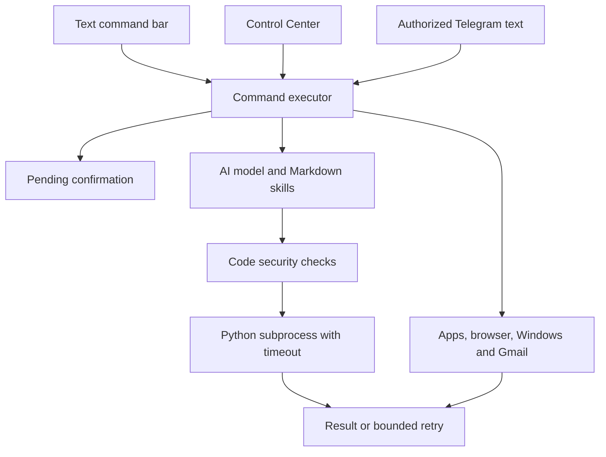

# Current command flow

```mermaid
flowchart TD
    Bar[Text command bar] --> Executor[Command executor]
    Dashboard[Control Center] --> Executor
    Telegram[Authorized Telegram text] --> Executor
    Executor --> Confirm[Pending confirmation]
    Executor --> Builtins[Apps, browser, Windows and Gmail]
    Executor --> Brain[AI model and Markdown skills]
    Brain --> Guard[Code security checks]
    Guard --> Runner[Python subprocess with timeout]
    Runner --> Result[Result or bounded retry]
    Builtins --> Result
```

The command bar's worker puts results into a queue. Tk reads the queue on its main thread and updates the window. Telegram attachments are not routed to the executor.
