# PRIVACY68 — High-Level Architecture

## System Architecture Diagram

```mermaid
flowchart TB
    %% ═══════════════════════════════════════════════════════════════
    %% STYLING
    %% ═══════════════════════════════════════════════════════════════
    classDef userNode fill:#1E293B,stroke:#06B6D4,stroke-width:3px,color:#F1F5F9,font-weight:bold
    classDef audioNode fill:#0F172A,stroke:#06B6D4,stroke-width:2px,color:#E2E8F0
    classDef speechNode fill:#0F172A,stroke:#8B5CF6,stroke-width:2px,color:#E2E8F0
    classDef routerNode fill:#1E1B4B,stroke:#A78BFA,stroke-width:3px,color:#F1F5F9,font-weight:bold
    classDef fastNode fill:#064E3B,stroke:#10B981,stroke-width:2px,color:#D1FAE5
    classDef slowNode fill:#7C2D12,stroke:#F97316,stroke-width:2px,color:#FED7AA
    classDef actionNode fill:#1E293B,stroke:#3B82F6,stroke-width:2px,color:#BFDBFE
    classDef skillNode fill:#1E3A5F,stroke:#38BDF8,stroke-width:2px,color:#E0F2FE
    classDef pluginNode fill:#312E81,stroke:#818CF8,stroke-width:2px,color:#E0E7FF
    classDef uiNode fill:#1C1917,stroke:#FBBF24,stroke-width:2px,color:#FEF3C7
    classDef osNode fill:#1E293B,stroke:#EF4444,stroke-width:2px,color:#FECACA
    classDef decisionNode fill:#1E1B4B,stroke:#C084FC,stroke-width:2px,color:#F5F3FF

    %% ═══════════════════════════════════════════════════════════════
    %% USER INPUT LAYER
    %% ═══════════════════════════════════════════════════════════════
    USER["🎙️ User Voice Input<br/><i>Microphone Audio Stream</i>"]:::userNode

    %% ═══════════════════════════════════════════════════════════════
    %% AUDIO CAPTURE & PREPROCESSING LAYER
    %% ═══════════════════════════════════════════════════════════════
    subgraph AUDIO_LAYER ["⎔ Audio Capture & Preprocessing Layer"]
        direction LR
        SOUNDDEVICE["🔊 SoundDevice<br/>InputStream<br/><i>16kHz · Mono · float32<br/>1280-sample blocks</i>"]:::audioNode
        AUDIOBUFFER["📦 Audio Queue<br/><i>Thread-Safe Buffer<br/>Producer–Consumer</i>"]:::audioNode
    end

    %% ═══════════════════════════════════════════════════════════════
    %% SPEECH PROCESSING LAYER
    %% ═══════════════════════════════════════════════════════════════
    subgraph SPEECH_LAYER ["⎔ Speech Processing Engine"]
        direction TB
        subgraph WAKE_DETECT ["Wake Word Detection"]
            WHISPER_IDLE["🗣️ Whisper Idle Scan<br/><i>0.8s overlapping windows<br/>beam_size=2</i>"]:::speechNode
            WAKE_REGEX["🔑 Wake Pattern<br/><i>Regex: privacy68 · alexa · nova<br/>+ inline command extraction</i>"]:::speechNode
        end
        VAD["🧠 Silero VAD<br/><i>ONNX Neural Model<br/>512-sample frames · 32ms<br/>Speech Probability ≥ 0.50</i>"]:::speechNode
        WHISPER["⚡ Faster-Whisper ASR<br/><i>CTranslate2 Engine<br/>medium.en · float16 CUDA / int8 CPU<br/>beam_size=8 · vad_filter</i>"]:::speechNode
    end

    %% ═══════════════════════════════════════════════════════════════
    %% SEMANTIC DECISION ENGINE (DUAL-LANE)
    %% ═══════════════════════════════════════════════════════════════
    subgraph DECISION_ENGINE ["⎔ Dual-Lane Semantic Decision Engine"]
        direction TB
        ROUTER_ENTRY["📝 Transcribed Text"]:::routerNode

        DECISION{"🔀 Semantic<br/>Router<br/><i>Confidence<br/>≥ 0.78?</i>"}:::decisionNode

        subgraph FAST_LANE ["⚡ Fast Lane — Instant Execution"]
            TFIDF["📊 TF-IDF Vectorizer<br/><i>Unigram + Bigram<br/>n-gram range: (1, 2)</i>"]:::fastNode
            COSINE["📐 Cosine Similarity<br/><i>User Vector vs.<br/>Knowledge Base Vectors</i>"]:::fastNode
        end

        subgraph SLOW_LANE ["🧠 Complex Lane — AI Inference"]
            OLLAMA["🤖 Ollama LLM<br/><i>Qwen 2.5 : 0.5B<br/>temp=0.2 · top_p=0.9<br/>num_ctx=512</i>"]:::slowNode
            SYSPROMPT["📋 Dynamic System<br/>Prompt Generator<br/><i>Active tools list<br/>from Skills + Plugins</i>"]:::slowNode
        end
    end

    %% ═══════════════════════════════════════════════════════════════
    %% ACTION EXECUTION LAYER
    %% ═══════════════════════════════════════════════════════════════
    subgraph ACTION_LAYER ["⎔ Action Execution Layer"]
        direction TB
        EXECUTOR["⚙️ Action Executor<br/><i>Resolved Intent → Skill/Plugin Dispatch</i>"]:::actionNode

        subgraph SKILL_PLUGIN ["Skills & Plugins Registry"]
            direction LR
            SKILL_MGR["📂 Skill Manager<br/><i>Built-in Skills Registry</i>"]:::skillNode
            PLUGIN_MGR["🧩 Plugin Manager<br/><i>Built-in + Custom Plugins<br/>Hot-reload · Enable/Disable<br/>%APPDATA%/PRIVACY68/plugins/</i>"]:::pluginNode
        end

        subgraph SKILLS_LIST ["Built-in Skills"]
            direction LR
            CHROME["🌐 Chrome<br/>Automation"]:::skillNode
            WEBSEARCH["🔍 Web<br/>Search"]:::skillNode
        end

        subgraph PLUGINS_LIST ["Extensible Plugins"]
            direction LR
            CHROME_P["🌐 Chrome<br/>Plugin"]:::pluginNode
            SYSTEM_P["💻 System<br/>Plugin"]:::pluginNode
            CUSTOM_P["➕ Custom<br/>User Plugins"]:::pluginNode
        end
    end

    %% ═══════════════════════════════════════════════════════════════
    %% OS AUTOMATION LAYER
    %% ═══════════════════════════════════════════════════════════════
    OS_LAYER["🖥️ Operating System<br/><i>Windows APIs · Process Launch<br/>Keyboard/Mouse Automation<br/>Application Control</i>"]:::osNode

    %% ═══════════════════════════════════════════════════════════════
    %% UI / FEEDBACK LAYER
    %% ═══════════════════════════════════════════════════════════════
    subgraph UI_LAYER ["⎔ User Interface & Feedback Layer"]
        direction LR
        UI_MGR["🎛️ UI Manager<br/><i>Thread-Safe Event Bridge</i>"]:::uiNode
        HUD["✨ Floating HUD<br/><i>Tkinter Overlay<br/>Click-Through · Neon Border<br/>Waveform Visualizer</i>"]:::uiNode
        TRAY["🔔 System Tray<br/><i>Status Indicator<br/>Quick Controls<br/>Plugin Manager Access</i>"]:::uiNode
        DASHBOARD["📊 Control Center<br/><i>Dashboard Bridge<br/>Settings & Config</i>"]:::uiNode
    end

    %% ═══════════════════════════════════════════════════════════════
    %% DATA FLOW CONNECTIONS
    %% ═══════════════════════════════════════════════════════════════

    %% Input flow
    USER -->|"Spoken Command"| SOUNDDEVICE
    SOUNDDEVICE -->|"Audio Chunks"| AUDIOBUFFER

    %% Speech processing flow
    AUDIOBUFFER -->|"Idle State"| WHISPER_IDLE
    WHISPER_IDLE -->|"Transcribed Idle Text"| WAKE_REGEX
    WAKE_REGEX -->|"'Privacy68' Detected → Activate"| VAD

    AUDIOBUFFER -->|"Active State"| VAD
    VAD -->|"Speech Confirmed +<br/>Silence Detected"| WHISPER

    %% Decision engine flow
    WHISPER -->|"Transcribed Command Text"| ROUTER_ENTRY
    ROUTER_ENTRY --> TFIDF
    TFIDF --> COSINE
    COSINE --> DECISION

    DECISION -->|"✅ High Confidence<br/>Match ≥ 0.78"| EXECUTOR
    DECISION -->|"❌ Low Confidence<br/>Fallback"| SYSPROMPT
    SYSPROMPT --> OLLAMA
    OLLAMA -->|"AI Selected Tool"| EXECUTOR

    %% Action execution flow
    EXECUTOR --> SKILL_MGR
    EXECUTOR --> PLUGIN_MGR
    SKILL_MGR --> CHROME
    SKILL_MGR --> WEBSEARCH
    PLUGIN_MGR --> CHROME_P
    PLUGIN_MGR --> SYSTEM_P
    PLUGIN_MGR --> CUSTOM_P

    %% OS automation
    CHROME --> OS_LAYER
    WEBSEARCH --> OS_LAYER
    CHROME_P --> OS_LAYER
    SYSTEM_P --> OS_LAYER
    CUSTOM_P --> OS_LAYER

    %% UI feedback flow (bidirectional)
    WHISPER -->|"Transcription Event"| UI_MGR
    WAKE_REGEX -->|"Wake Word Event"| UI_MGR
    VAD -->|"Audio Energy Level"| UI_MGR
    EXECUTOR -->|"Execution Result"| UI_MGR
    UI_MGR --> HUD
    UI_MGR --> TRAY
    UI_MGR --> DASHBOARD

    %% Plugin hot-reload
    PLUGIN_MGR -.->|"🔄 Hot-Reload<br/>Listener"| COSINE
```



---

## Architecture Overview

### Layer Breakdown

| Layer | Module(s) | Responsibility |
|:------|:----------|:---------------|
| **Audio Capture** | `SoundDevice InputStream` | Captures 16kHz mono float32 audio in 1280-sample blocks (~80ms) via a callback-driven producer–consumer queue |
| **Wake Word Detection** | `SpeechStreamer` (idle scan) | Transcribes short overlapping 0.8s audio windows with Whisper to detect the configured wake word (e.g., "Privacy68") via regex pattern matching |
| **Voice Activity Detection** | `SileroVAD` (ONNX) | Neural speech-probability model processing 512-sample frames (32ms); distinguishes human speech from silence/noise |
| **ASR Engine** | `Faster-Whisper` + `CTranslate2` | Quantized transformer ASR — `medium.en` model with float16 (CUDA) or int8 (CPU) precision, beam search, VAD filter, and hotword biasing |
| **Fast Lane** | `SemanticRouter` | TF-IDF (1,2)-gram vectorizer + cosine similarity against indexed intent phrases; threshold ≥ 0.78 for instant match |
| **Complex Lane** | `Ollama` + `Qwen 2.5:0.5B` | Local LLM fallback with dynamically generated system prompt listing all active tools; selects the best-matching tool name |
| **Action Executor** | `execute_system_command()` | Dispatches the resolved intent to the correct skill or plugin handler |
| **Skills** | `Chrome`, `WebSearch` | Built-in automation modules with predefined fast-lane intents and execution logic |
| **Plugin System** | `PluginManager` | Dynamic plugin discovery (built-in + `%APPDATA%` user plugins), enable/disable toggling, hot-reload, install/uninstall, and template scaffolding |
| **UI Layer** | `UIManager`, `FloatingHUD`, `SystemTray`, `Dashboard` | Thread-safe event bridge driving a click-through neon HUD overlay, system tray status indicator, and control center dashboard |

### Key Design Decisions

> [!IMPORTANT]
> **Dual-Lane Routing** — The fast lane (TF-IDF + cosine similarity) handles ~80% of known commands with sub-millisecond latency. Only ambiguous or novel requests fall through to the local LLM, avoiding unnecessary GPU/CPU inference overhead.

> [!NOTE]
> **Privacy-First** — All speech capture, transcription, intent routing, and LLM inference happen entirely on-device. No audio or text data leaves the user's machine.

> [!TIP]
> **Plugin Hot-Reload** — When plugins are enabled/disabled via the UI, the `PluginManager` notifies the `SemanticRouter` to re-index its TF-IDF knowledge base vectors in real-time, with zero restarts required.

### Data Flow Summary

```
🎙️ Microphone
  → SoundDevice (16kHz/mono/float32)
    → Audio Queue (thread-safe buffer)
      → [IDLE] Whisper Idle Scan → Wake Regex ("Privacy68"?)
        → [ACTIVE] Silero VAD (speech detection)
          → Faster-Whisper ASR (full transcription)
            → Semantic Router
              → [FAST] TF-IDF + Cosine ≥ 0.78 → Direct Execution
              → [SLOW] Ollama Qwen 2.5 → AI Tool Selection → Execution
                → Skill / Plugin Handler
                  → OS Automation (Windows APIs, process control)
                    → UI Feedback (HUD + Tray status update)
```
